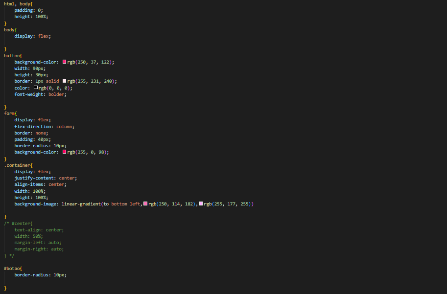
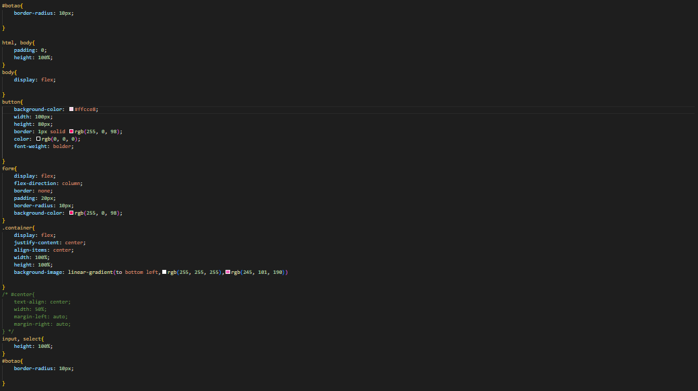
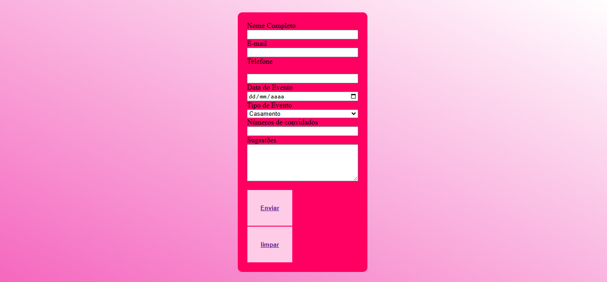

# form-Cadevento
Projeto criado como parte avaliativa da disciplina de Fundamentos de desenvolvimento ministrada pelo professor Leonardo Rocha.
Esse projeto foi feito com base nos projeto de [Cadastro Ecommerce](https://github.com/yasmim0517/form-CadEcommerce-) [Formulário de Contato](https://github.com/yasmim0517/form-contato) e [Formulário de Login](https://github.com/yasmim0517/projeto-login).

## Índice

* [Descrição](#descrição)

* [Tecnologias](#tecnologias)

* [Referências](#referências)

* [Autor(a)](#autora)

### Descrição
O projeto consiste em criarmos uma tela de Formulario de evento. Nessa tela de formulario,
é possivel que o "cliente" informe seu nome, qual o tipo de evento que ele quer que nós do buffet realize,
depois o cliente precisa informar a data do evento etc..
 
#### Formulario

Veja a imagem do formulario de evento, consiste em inserir seu nome completo, telefone, e-mail, data do evento, tipo de evento, como: Casamento, Aniversario, Corporativo, Festa de fim de ano, Religioso, Educacional e Entretenimento, tambem é possivel anotar uma sugestao para o uso de adicionar coisas do seu jeito e etc.

Veja a imagem da estilizaçao do projeto, consiste nas cor e tamanho do nosso formulario de evento .

### Resultado do projeto

## Tecnologias

* HTML5
* CSS3

## Referências

 [Alura](

https://www.alura.com.br/artigos/escrever-bom-readme

) - Como escrever um README incrivel no seu gitHub  

## Autor(a)

`O projeto foi desenvolvido por:`

* Yasmim Faria
